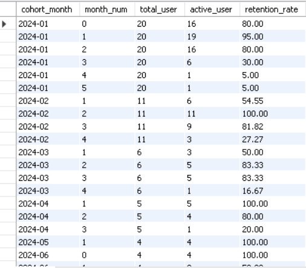
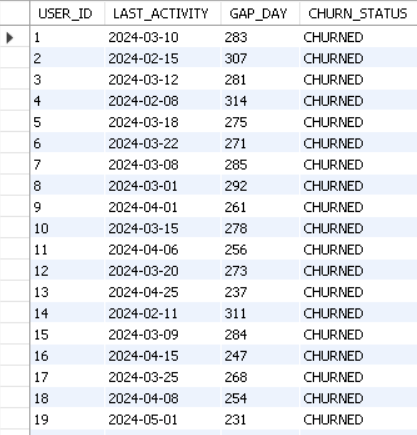
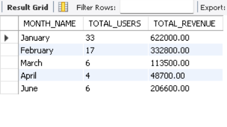
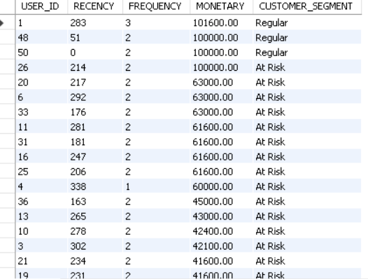

# 📊 Product Analytics SQL Case Study

> A real-world SQL case study focused on analyzing user engagement, customer retention, purchasing behavior, and revenue performance using MySQL.

---

## 📌 Project Overview

This project simulates how a Product Analytics team uses SQL to answer real business questions. Using a relational database consisting of users, events, products, and orders, I analyzed customer behavior, engagement metrics, retention trends, and revenue performance to generate actionable business insights.

The objective of this project was not just to write SQL queries, but to solve practical product and business problems using data.

---

## 🎯 Business Questions Addressed

This project answers the following key business questions:

- How many users are active daily and monthly?
- How engaged are users with the product?
- What is the user retention rate?
- Which customer cohorts perform the best over time?
- Which users have churned?
- How frequently do customers make purchases?
- Which customer cohorts generate the highest revenue?
- Who are the highest-value customers?
- How can customers be segmented using the RFM model?

---
## 🚀 Product Analytics Metrics Covered

-  Daily Active Users (DAU)
-  Monthly Active Users (MAU)
-  Stickiness Ratio
-  Day-1 Retention
-  Overall User Retention
-  Cohort Analysis
-  Customer Churn Analysis
-  Reactivated Users
-  First Purchase Conversion Rate
-  Repeat Purchase Rate
-  Average Time to First Purchase
-  Revenue by Cohort
-  Monthly Active Paying Users (MAPU)
-  Customer Lifetime Value (LTV)
-  Top Customers by Revenue
-  Revenue Contribution Analysis
-  Purchase Frequency
-  RFM Customer Segmentation
---
## 🛠️ Tech Stack

- **Database:** MySQL
- **Language:** SQL

---

## 🗂️ Database Schema

The project is built using four relational tables.

| Table | Description |
|--------|-------------|
| **Users** | Customer information and signup dates |
| **Events** | User activities such as login and purchase events |
| **Products** | Product catalog with category and pricing |
| **Orders** | Customer purchase transactions |

---

## 🧠 SQL Concepts Used

- Common Table Expressions (CTEs)
- Joins
- Aggregate Functions
- Window Functions
- Date Functions
- CASE Statements
- Subqueries
- Ranking Functions
- Customer Segmentation
- Revenue Analysis

---

# 📈 Business Analysis

## 📊 Cohort Analysis

Customer cohorts were created based on their signup month to understand how user retention changes over time.

**Key Insight**

- January cohort started with **80% activity** and gradually declined over subsequent months.
- Later cohorts showed stronger short-term retention but required longer observation periods.
- Cohort analysis helps evaluate long-term customer engagement after acquisition.
> QUERY
```
with cohort_user as 
(
select user_id ,signup_date,
date_format(signup_date,"%Y-%m") as cohort_month
from users),
user_activity as (
select c.user_id , c.signup_date,c.cohort_month , timestampdiff(month,c.signup_date,e.event_date) as month_num
from cohort_user c 
join events e 
on e.user_id = c.user_id
where event_date >= signup_date),
cohort_retention as (
select cohort_month , month_num,
count(distinct user_id) as active_user
from user_activity
group by cohort_month, month_num),
total_user as(
select cohort_month , count(user_id) as total_user
from cohort_user
group by cohort_month )
select c.cohort_month , 
c.month_num,
t.total_user,
c.active_user,
round((c.active_user/t.total_user)*100,2) as retention_rate
from cohort_retention c 
join total_user t 
on c.cohort_month = t.cohort_month
order by c.cohort_month , 
c.month_num;

```
> OUTPUT
<p align="center">

</p>

---

## 🚪 Customer Churn Analysis

Users were classified as **Churned** if they remained inactive for more than **30 days** after their last recorded activity.

**Key Insight**

- Most inactive users exceeded the 30-day threshold.
- Churn analysis helps identify users who may require re-engagement campaigns.
> QUERY
```
WITH LAST_ACT AS 
(SELECT USER_ID , MAX(EVENT_DATE) AS LAST_ACTIVITY
FROM EVENTS 
GROUP BY USER_ID),
GAP_DAYS AS (
SELECT USER_ID , LAST_ACTIVITY, datediff((SELECT MAX(EVENT_DATE) FROM EVENTS),LAST_ACTIVITY) AS GAP_DAY
FROM LAST_ACT
GROUP BY USER_ID,LAST_ACTIVITY,GAP_DAY)
SELECT *,CASE
WHEN GAP_DAY > 30 
THEN "CHURNED"
ELSE "NOT_CHURNED"
END  AS CHURN_STATUS FROM GAP_dAYS;

WITH LAST_ACT AS (
SELECT USER_ID , MAX(EVENT_DATE) AS LAST_ACTIVITY
FROM EVENTS 
GROUP BY USER_ID),
LAST_LOGIN AS (
SELECT MAX(EVENT_DATE) AS LAST_DATE
FROM EVENTS)
SELECT COUNT(*) AS TOTAL_USERS , 
SUM(CASE WHEN DATEDIFF(A.LAST_dATE,L.LAST_ACTIVITY) > 30 
THEN 1 
ELSE 0 
END ) AS TOTAL_CHURNED_USERS,
ROUND(SUM(CASE WHEN DATEDIFF(A.LAST_DATE,L.LAST_ACTIVITY)>30
THEN 1
ELSE 0 
END)*100/COUNT(*) ,2) AS CHURN_RATE
FROM LAST_ACT L 
CROSS JOIN LAST_LOGIN A;
```
> OUPUT
<p align="center">

</p>

---

## 💰 Revenue by Cohort

Revenue generated by customers was analyzed based on their signup cohort to identify the most valuable acquisition periods.

**Key Insight**

- January customers generated the highest total revenue.
- Cohort revenue helps measure the long-term value of customer acquisition efforts.
> QUERY
 ```
WITH COHORT_MONTH AS 
(SELECT USER_ID , monthname(SIGNUP_DATE) AS MONTH_NAME 
FROM USERS
GROUP BY USER_ID),
TOTAL_REVENUE AS (
SELECT U.MONTH_NAME AS MONTH_NAME , COUNT(U.USER_ID) AS TOTAL_USERS ,SUM(O.QUANTITY*P.PRICE) AS TOTAL_REVENUE
FROM PRODUCT_USER P 
JOIN ORDERS_USER O 
ON P.PRODUCT_ID = O.PRODUCT_ID
JOIN COHORT_MONTH U
ON U.USER_ID = O.USER_ID
GROUP BY MONTH_NAME)

SELECT * FROM TOTAL_REVENUE;
 ```
> OUTPUT
<p align="center">

</p>

---

## 🎯 RFM Customer Segmentation

Customers were segmented using the **RFM (Recency, Frequency, Monetary)** model to identify high-value, loyal, and at-risk customers.

**Key Insight**

- Customers with high monetary value and recent purchases are the most valuable.
- Several customers were identified as **At Risk**, indicating opportunities for retention campaigns.
> QUERY
```
WITH LAST_PUR AS (
SELECT USER_ID, MAX(ORDER_DATE) LAST_USER_PURC
FROM ORDERS_USER
GROUP BY USER_ID ),
TOTAL_LAST_PUR AS (
SELECT MAX(ORDER_DATE)  LAST_PURCHASE FROM ORDERS_USER),
RECENCY AS (
SELECT * , DATEDIFF(T.LAST_PURCHASE,L.LAST_USER_PURC) AS RECENCY
FROM LAST_PUR L
CROSS JOIN TOTAL_LAST_PUR T),
USER_ORDERS AS (
SELECT USER_ID , COUNT(*) AS FREQUENCY FROM 
ORDERS_USER 
GROUP BY USER_ID),
MONETARY AS (
 SELECT
        O.USER_ID,
        SUM(O.QUANTITY * P.PRICE) AS MONETARY
    FROM ORDERS_USER O
    JOIN PRODUCT_USER P
        ON O.PRODUCT_ID = P.PRODUCT_ID
    GROUP BY O.USER_ID
),RFM AS (
SELECT
    R.USER_ID,
    R.RECENCY,
    U.FREQUENCY,
    M.MONETARY
FROM RECENCY R
JOIN USER_ORDERS U
    ON R.USER_ID = U.USER_ID
JOIN MONETARY M
    ON R.USER_ID = M.USER_ID
ORDER BY M.MONETARY DESC),

```
> OUTPUT
<p align="center">

</p>

---

# 💡 Key Business Insights

- Measured user engagement using DAU, MAU, and Stickiness Ratio.
- Identified customer retention trends through Cohort Analysis.
- Detected inactive users using Churn Analysis.
- Compared revenue generated across customer cohorts.
- Identified top revenue-generating customers.
- Measured customer purchasing behavior.
- Segmented customers using the RFM model for targeted marketing strategies.

---

# 🚀 About This Project

This project was built to strengthen my SQL skills through real-world product analytics scenarios. It demonstrates how SQL can be used to answer business questions, measure customer behavior, and generate insights that support data-driven decision-making.

If you have any suggestions or feedback, feel free to connect with me on LinkedIn.
